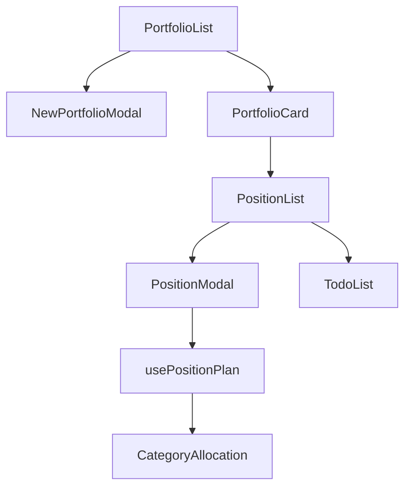

# MyStock MVP Project Structure

## Core Data Types

```typescript
Portfolio {
  id: number
  groupId: number
  name?: string
  broker: string
  accountNumber: string
  accountName: string
  currency: "KRW" | "USD"
  config: PortfolioConfig
  positions?: Position[]
}

Position {
  id: number
  portfolioId: number
  symbol: string
  name: string
  quantity: number
  avgPrice: number
  currentPrice: number
  tradeDate: number
  strategyCategory: PortfolioCategory
  strategyTags: string[]
  category?: PortfolioCategory
  strategy?: string
  entryCount?: number
  maxEntries?: number
  targetQuantity?: number
}

PortfolioConfig {
  totalCapital: number
  categoryAllocations: Record<PortfolioCategory, CategoryAllocation>
}

CategoryAllocation {
  targetPercentage: number
  maxStockPercentage: number
  maxEntries: number
}
```

## Data Flow



## Service Layer Architecture

```
Services/
├── db.ts - Dexie-based IndexedDB wrapper
├── portfolioService.ts - Portfolio CRUD + business logic
├── positionService.ts - Position management + calculations
└── todoService.ts - Todo management
```

## Key Features & Implementation Notes

### 1. Portfolio Management
- Hierarchical: PortfolioGroup > Portfolio > Position
- Each portfolio has configurable category allocations
- Default category allocations provided on creation

### 2. Position Tracking
- Supports DCA (Dollar Cost Averaging)
- Entry counting and max entries limit
- Target quantity tracking
- Strategy categorization

### 3. Investment Planning
- Category-based allocation
- Risk management via maxStockPercentage
- Progress tracking per position
- Entry point calculation

### 4. Data Persistence
- IndexedDB via Dexie.js
- Automatic schema migrations
- Backup/restore functionality
- Server sync capability (planned)

## Component Dependencies

```
PortfolioList
└── NewPortfolioModal
    └── usePortfolios
        └── PortfolioService
            └── db

PositionModal
├── usePositionPlan
│   └── CategoryAllocation
└── PortfolioConfig

TodoList
└── TodoService
    └── db
```

## State Management

1. Local Component State
   - Form inputs
   - UI toggles
   - Loading states

2. Service Layer State
   - Database operations
   - Business logic
   - Data transformations

3. Shared Hooks
   - usePortfolios
   - usePositionPlan
   - usePortfolioManager

## Default Configuration

```typescript
DEFAULT_CATEGORY_ALLOCATIONS = {
  LONG_TERM: {
    targetPercentage: 50,
    maxStockPercentage: 10,
    maxEntries: 3
  },
  GROWTH: {
    targetPercentage: 30,
    maxStockPercentage: 7.5,
    maxEntries: 2
  },
  SHORT_TERM: {
    targetPercentage: 5,
    maxStockPercentage: 5,
    maxEntries: 1
  },
  CASH: {
    targetPercentage: 15,
    maxStockPercentage: 100,
    maxEntries: 1
  },
  UNCATEGORIZED: {
    targetPercentage: 0,
    maxStockPercentage: 0,
    maxEntries: 1
  }
}
```

## Development Notes

### Critical Paths
1. Portfolio Creation -> Position Addition -> Investment Planning
2. Position Updates -> Category Allocation Checks -> Rebalancing
3. Todo Creation -> Position Linking -> Completion Tracking

### Type Safety Considerations
1. Ensure PortfolioConfig completeness
2. Validate CategoryAllocation percentages
3. Handle optional Position fields
4. Maintain currency type safety

### Performance Optimization Points
1. Portfolio list rendering
2. Position calculations
3. Category allocation updates
4. Database operations

### Future Enhancement Areas
1. Real-time price updates
2. Advanced position planning
3. Portfolio analytics
4. Multi-currency support
5. Tax lot tracking 