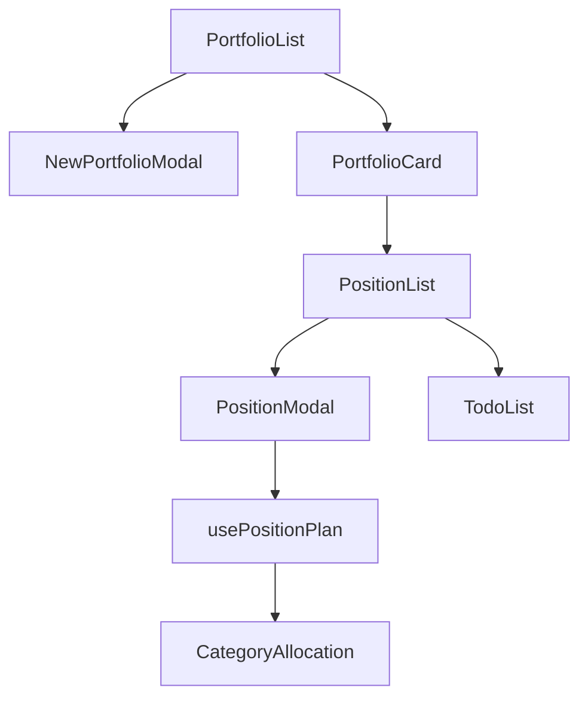

# MyStock MVP 프로젝트 구조

## 디렉토리 구조

```
mystock-mvp/
├── src/
│   ├── components/     # 재사용 가능한 컴포넌트
│   ├── pages/         # 페이지 컴포넌트
│   ├── services/      # 비즈니스 로직 및 API 호출
│   ├── hooks/         # 커스텀 훅
│   ├── types/         # TypeScript 타입 정의
│   └── utils/         # 유틸리티 함수
```

## 주요 페이지 구조

### 포트폴리오 그룹 관련
- `/portfolio-groups`
  - 설명: 포트폴리오 그룹 목록 페이지
  - 파일: `src/pages/PortfolioList.tsx`
  - 컴포넌트: `src/components/PortfolioList.tsx`

- `/portfolio-groups/new`
  - 설명: 새 포트폴리오 그룹 생성 페이지
  - 파일: `src/pages/NewPortfolioGroup.tsx`

- `/portfolio-groups/:id`
  - 설명: 포트폴리오 그룹 상세 페이지
  - 파일: `src/pages/PortfolioDetail.tsx`

- `/portfolio-groups/:id/config`
  - 설명: 포트폴리오 그룹 설정 페이지
  - 파일: `src/pages/PortfolioConfigPage.tsx`

### 포트폴리오 관련
- `/portfolio-groups/:groupId/portfolios/new`
  - 설명: 새 포트폴리오 생성 페이지
  - 파일: `src/pages/NewPortfolio.tsx`

- `/portfolio-groups/:portfolioId/positions/new`
  - 설명: 새 포지션 생성 페이지
  - 파일: `src/pages/NewPosition.tsx`

- `/portfolio-groups/:portfolioId/positions/:positionId/edit`
  - 설명: 포지션 수정 페이지
  - 파일: `src/pages/EditPosition.tsx`

### 계좌 관련
- `/accounts`
  - 설명: 계좌 목록 페이지
  - 파일: `src/pages/AccountList.tsx`

- `/accounts/new`
  - 설명: 새 계좌 생성 페이지
  - 파일: `src/pages/NewAccount.tsx`

- `/accounts/:id`
  - 설명: 계좌 상세 페이지
  - 파일: `src/pages/AccountDetail.tsx`

- `/accounts/:id/edit`
  - 설명: 계좌 수정 페이지
  - 파일: `src/pages/EditAccount.tsx`

## 주요 컴포넌트

### 포트폴리오 관련
- `PortfolioList`: 포트폴리오 목록을 표시하는 컴포넌트
- `PortfolioDetail`: 포트폴리오 상세 정보를 표시하는 컴포넌트
- `NewPortfolioModal`: 새 포트폴리오 생성 모달

### 포지션 관련
- `PositionList`: 포지션 목록을 표시하는 컴포넌트
- `PositionDetail`: 포지션 상세 정보를 표시하는 컴포넌트

## 데이터 흐름

1. 포트폴리오 그룹
   - PortfolioGroupService: 포트폴리오 그룹 관련 CRUD 작업
   - 데이터 저장소: IndexedDB (Dexie.js)

2. 포트폴리오
   - PortfolioService: 포트폴리오 관련 CRUD 작업
   - 데이터 저장소: IndexedDB (Dexie.js)

3. 포지션
   - PositionService: 포지션 관련 CRUD 작업
   - 데이터 저장소: IndexedDB (Dexie.js)

## 주의사항

1. 라우팅
   - 모든 포트폴리오 관련 경로는 `/portfolio-groups`로 시작
   - URL 파라미터는 명확한 의미를 가진 이름 사용 (예: `:groupId`, `:portfolioId`)

2. 컴포넌트 구조
   - 페이지 컴포넌트는 `/pages` 디렉토리에 위치
   - 재사용 가능한 컴포넌트는 `/components` 디렉토리에 위치

3. 네이밍 규칙
   - 파일명: PascalCase (예: PortfolioList.tsx)
   - 컴포넌트명: PascalCase (예: PortfolioList)
   - 서비스명: PascalCase + 'Service' (예: PortfolioService)

## Core Data Types

```typescript
Portfolio {
  id: number
  groupId: number
  name?: string
  broker: string
  accountNumber: string
  accountName: string
  currency: "KRW" | "USD"
  config: PortfolioConfig
  positions?: Position[]
}

Position {
  id: number
  portfolioId: number
  symbol: string
  name: string
  quantity: number
  avgPrice: number
  currentPrice: number
  tradeDate: number
  strategyCategory: PortfolioCategory
  strategyTags: string[]
  category?: PortfolioCategory
  strategy?: string
  entryCount?: number
  maxEntries?: number
  targetQuantity?: number
}

PortfolioConfig {
  totalCapital: number
  categoryAllocations: Record<PortfolioCategory, CategoryAllocation>
}

CategoryAllocation {
  targetPercentage: number
  maxStockPercentage: number
  maxEntries: number
}
```

## Data Flow



## Service Layer Architecture

```
Services/
├── db.ts - Dexie-based IndexedDB wrapper
├── portfolioService.ts - Portfolio CRUD + business logic
├── positionService.ts - Position management + calculations
└── todoService.ts - Todo management
```

## Key Features & Implementation Notes

### 1. Portfolio Management
- Hierarchical: PortfolioGroup > Portfolio > Position
- Each portfolio has configurable category allocations
- Default category allocations provided on creation

### 2. Position Tracking
- Supports DCA (Dollar Cost Averaging)
- Entry counting and max entries limit
- Target quantity tracking
- Strategy categorization

### 3. Investment Planning
- Category-based allocation
- Risk management via maxStockPercentage
- Progress tracking per position
- Entry point calculation

### 4. Data Persistence
- IndexedDB via Dexie.js
- Automatic schema migrations
- Backup/restore functionality
- Server sync capability (planned)

## Component Dependencies

```
PortfolioList
└── NewPortfolioModal
    └── usePortfolios
        └── PortfolioService
            └── db

PositionModal
├── usePositionPlan
│   └── CategoryAllocation
└── PortfolioConfig

TodoList
└── TodoService
    └── db
```

## State Management

1. Local Component State
   - Form inputs
   - UI toggles
   - Loading states

2. Service Layer State
   - Database operations
   - Business logic
   - Data transformations

3. Shared Hooks
   - usePortfolios
   - usePositionPlan
   - usePortfolioManager

## Default Configuration

```typescript
DEFAULT_CATEGORY_ALLOCATIONS = {
  LONG_TERM: {
    targetPercentage: 50,
    maxStockPercentage: 10,
    maxEntries: 3
  },
  GROWTH: {
    targetPercentage: 30,
    maxStockPercentage: 7.5,
    maxEntries: 2
  },
  SHORT_TERM: {
    targetPercentage: 5,
    maxStockPercentage: 5,
    maxEntries: 1
  },
  CASH: {
    targetPercentage: 15,
    maxStockPercentage: 100,
    maxEntries: 1
  },
  UNCATEGORIZED: {
    targetPercentage: 0,
    maxStockPercentage: 0,
    maxEntries: 1
  }
}
```

## Development Notes

### Critical Paths
1. Portfolio Creation -> Position Addition -> Investment Planning
2. Position Updates -> Category Allocation Checks -> Rebalancing
3. Todo Creation -> Position Linking -> Completion Tracking

### Type Safety Considerations
1. Ensure PortfolioConfig completeness
2. Validate CategoryAllocation percentages
3. Handle optional Position fields
4. Maintain currency type safety

### Performance Optimization Points
1. Portfolio list rendering
2. Position calculations
3. Category allocation updates
4. Database operations

### Future Enhancement Areas
1. Real-time price updates
2. Advanced position planning
3. Portfolio analytics
4. Multi-currency support
5. Tax lot tracking 
